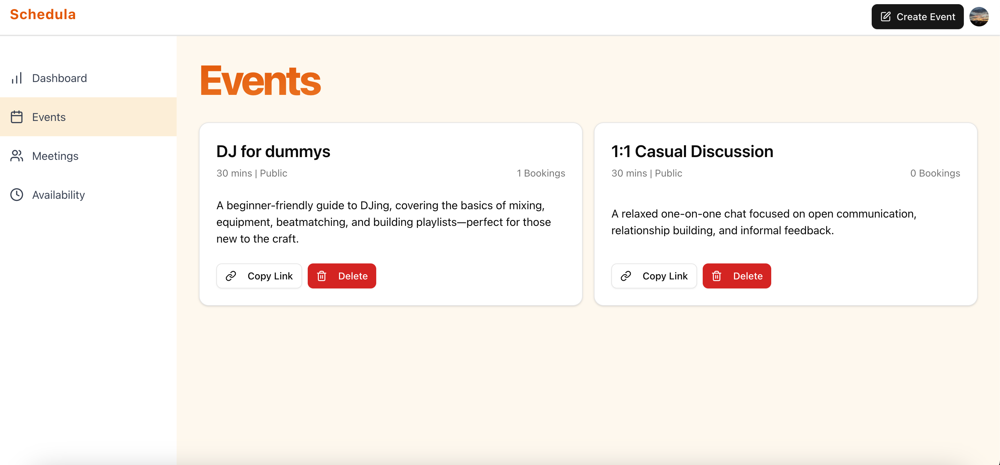
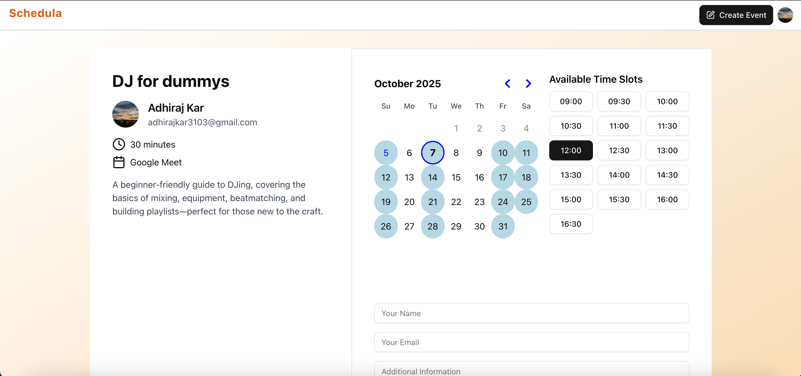
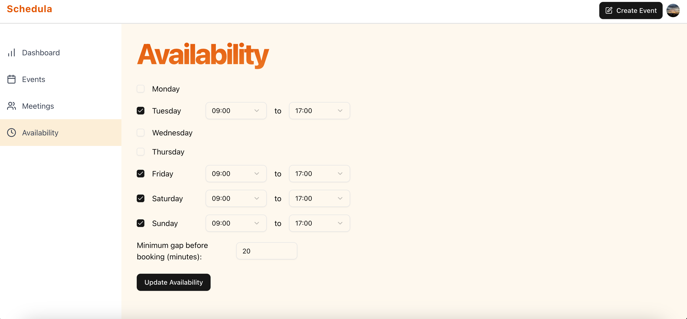

# Schedula

**Schedula** is a modern scheduling application built with Next.js, similar to Calendly but with enhanced Google integration features. The app allows users to create events, manage availability, and automatically generates Google Meet links for virtual meetings while seamlessly integrating with Google Calendar.

## ✨ Key Features

- **📅 Event Scheduling**: Create and manage custom events with flexible time slots
- **🔗 Google Meet Integration**: Automatically generates Google Meet links for all bookings
- **📆 Google Calendar Sync**: Seamlessly adds events to your Google Calendar
- **⏰ Availability Management**: Set your availability preferences and time zones
- **👤 User Authentication**: Secure sign-in/sign-up with Clerk
- **📱 Responsive Design**: Works perfectly on desktop and mobile devices
- **🎨 Modern UI**: Built with Tailwind CSS and Radix UI components

## 📸 Screenshots

### Events Dashboard

*Main events dashboard showing your created events and management options*

### Booking Interface

*User-friendly booking interface with Google Meet integration and calendar selection*

### Availability Settings

*Configure your availability preferences and working hours*

## 🚀 Getting Started

### Prerequisites

- Node.js 18+ 
- A Google Cloud Console project with Calendar API enabled
- Clerk account for authentication

### Installation

1. Clone the repository:
```bash
git clone <repository-url>
cd calendly-clone
```

2. Install dependencies:
```bash
npm install
```

3. Set up environment variables:
Create a `.env.local` file with your configuration:
```bash
# Clerk Authentication
NEXT_PUBLIC_CLERK_PUBLISHABLE_KEY=your_clerk_key
CLERK_SECRET_KEY=your_clerk_secret

# Database
DATABASE_URL=your_database_url

# Google API (configured through Clerk OAuth)
```

4. Set up the database:
```bash
npx prisma migrate dev
```

5. Run the development server:
```bash
npm run dev
```

Open [http://localhost:3000](http://localhost:3000) to see the application.

## 🔧 Tech Stack

- **Framework**: [Next.js 15](https://nextjs.org) with App Router
- **Database**: PostgreSQL with [Prisma ORM](https://prisma.io)
- **Authentication**: [Clerk](https://clerk.com)
- **Styling**: [Tailwind CSS](https://tailwindcss.com)
- **UI Components**: [Radix UI](https://radix-ui.com)
- **Google Integration**: [Google APIs](https://github.com/googleapis/google-api-nodejs-client)
- **Form Handling**: React Hook Form with Zod validation

## 🎯 Google Integration Features

### Google Calendar Integration
- **Automatic Event Creation**: When a booking is made, it's automatically added to both the host's and attendee's Google Calendar
- **Event Management**: Cancelling a meeting removes it from Google Calendar
- **OAuth Authentication**: Secure Google account linking through Clerk

### Google Meet Integration  
- **Automatic Meet Links**: Every booking automatically generates a unique Google Meet link
- **Conference Data**: Uses Google Calendar's conference data API to create Meet rooms
- **Join Links**: Easy one-click access to meetings from the dashboard

### Implementation Details
Key files handling Google integration:
- `actions/bookings.js:createBooking()` - Creates calendar events with Meet links
- `actions/meetings.js` - Manages meeting operations and calendar sync
- `components/booking-form.jsx` - Displays Meet links to users
- `components/meeting-list.jsx` - Shows scheduled meetings with join links

## 📁 Project Structure

```
├── actions/           # Server actions for API calls
├── app/              # Next.js App Router pages
├── components/       # Reusable UI components
├── hooks/            # Custom React hooks
├── lib/              # Utility functions and configurations
├── prisma/           # Database schema and migrations
├── screenshots/      # Application screenshots
└── public/           # Static assets
```

## 🛠 Development

### Available Scripts

- `npm run dev` - Start development server with Turbopack
- `npm run build` - Build for production
- `npm run start` - Start production server
- `npm run lint` - Run ESLint
- `npx prisma studio` - Open Prisma Studio for database management

### Database Schema

The app uses Prisma with the following key models:
- **User**: User profiles and authentication data
- **Event**: Schedulable events with duration and descriptions
- **Booking**: Individual meeting bookings with Google Meet links and Calendar event IDs
- **Availability**: User availability preferences

## 🚀 Deployment

### Vercel (Recommended)

1. Connect your repository to [Vercel](https://vercel.com)
2. Configure environment variables in the Vercel dashboard
3. Deploy automatically on git push

### Other Platforms

The app can be deployed on any platform that supports Next.js applications. Make sure to:
- Set up environment variables
- Configure your database
- Run `npm run build` to create the production build

## 📋 Environment Setup

### Google Cloud Console Setup

1. Create a new project in [Google Cloud Console](https://console.cloud.google.com)
2. Enable the Google Calendar API
3. Configure OAuth consent screen
4. Add your OAuth credentials to Clerk

### Clerk Setup

1. Create a [Clerk](https://clerk.com) account
2. Configure Google OAuth provider
3. Add your domain to allowed origins
4. Copy your publishable and secret keys

## 🤝 Contributing

1. Fork the repository
2. Create a feature branch (`git checkout -b feature/amazing-feature`)
3. Commit your changes (`git commit -m 'Add amazing feature'`)
4. Push to the branch (`git push origin feature/amazing-feature`)
5. Open a Pull Request

## 📄 License

This project is licensed under the MIT License - see the LICENSE file for details.
